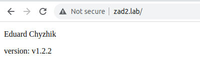
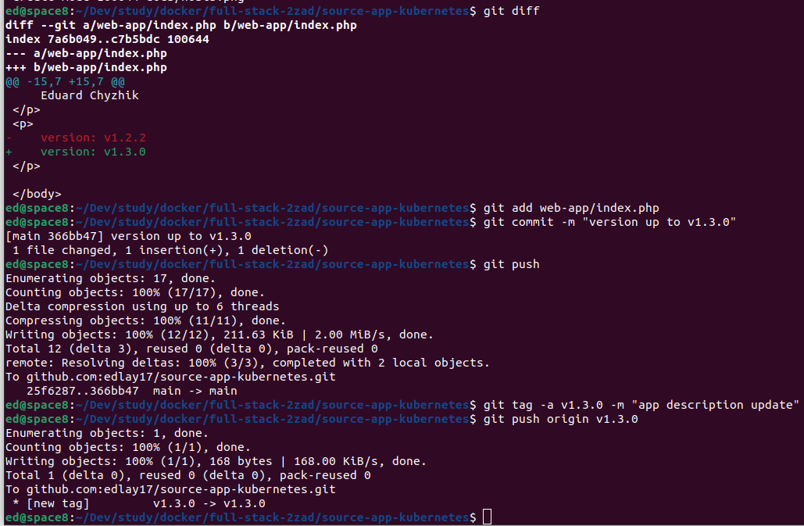
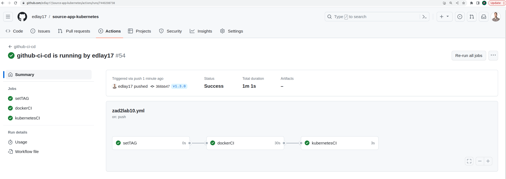
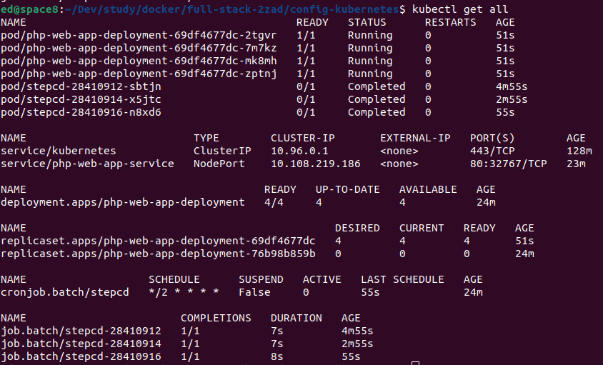
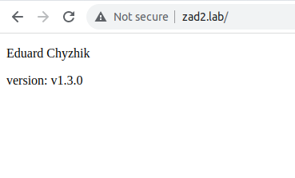
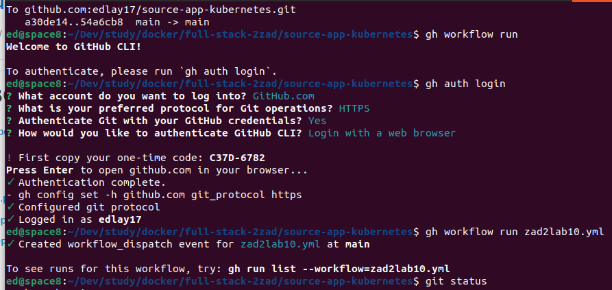
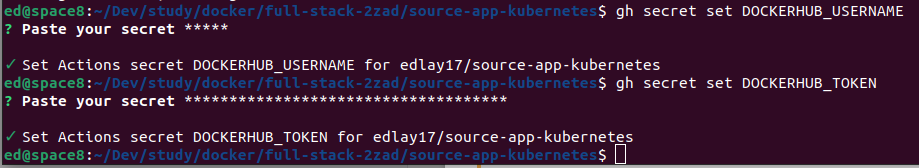
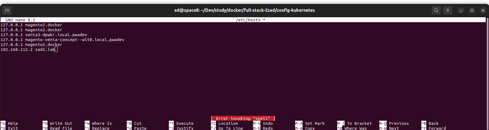

# source-app-kubernetes

[Config repo](https://github.com/edlay17/config-kubernetes)

## App work demonstrating

---

### Using of git cli for trigger action and add docker hub credentials

### Configure etc/hosts to make available access on http://zad2.lab/

